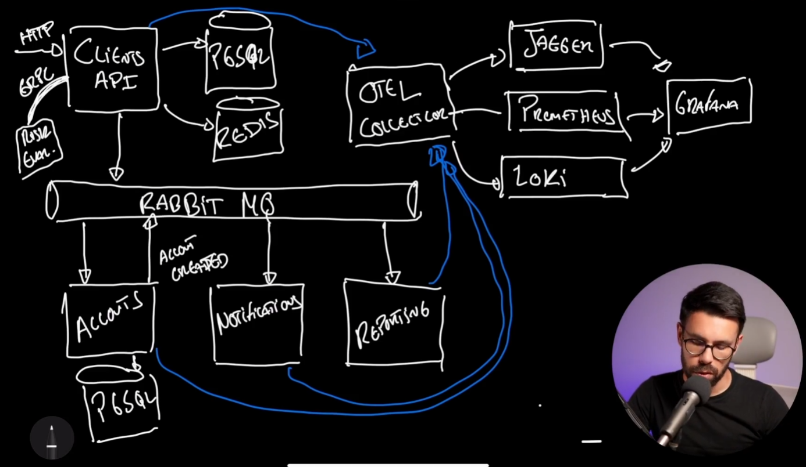

# System Architecture

The system will start with an API call and then use messaging to pass events around the system which will perform actions based on those events.

Everything will collect and send telemetry and send it to the OTel Collector.

They system makes use of open source products and will rely on Docker/Docker Compose to run them.

## PostgreSQL

## Rabbit MQ

## Jaeger

## Prometheus

## Grafana

## Loki